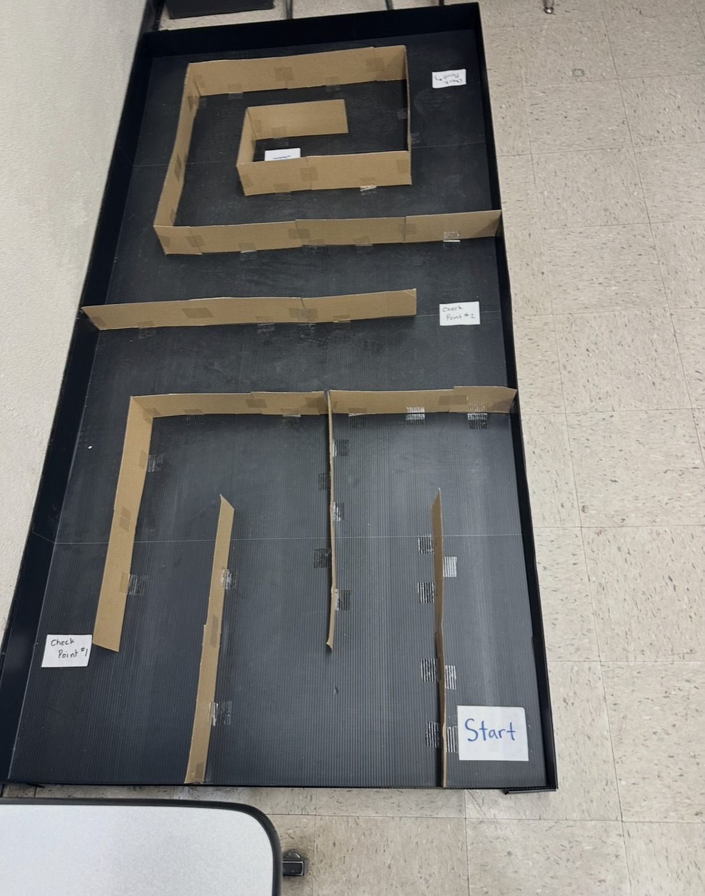
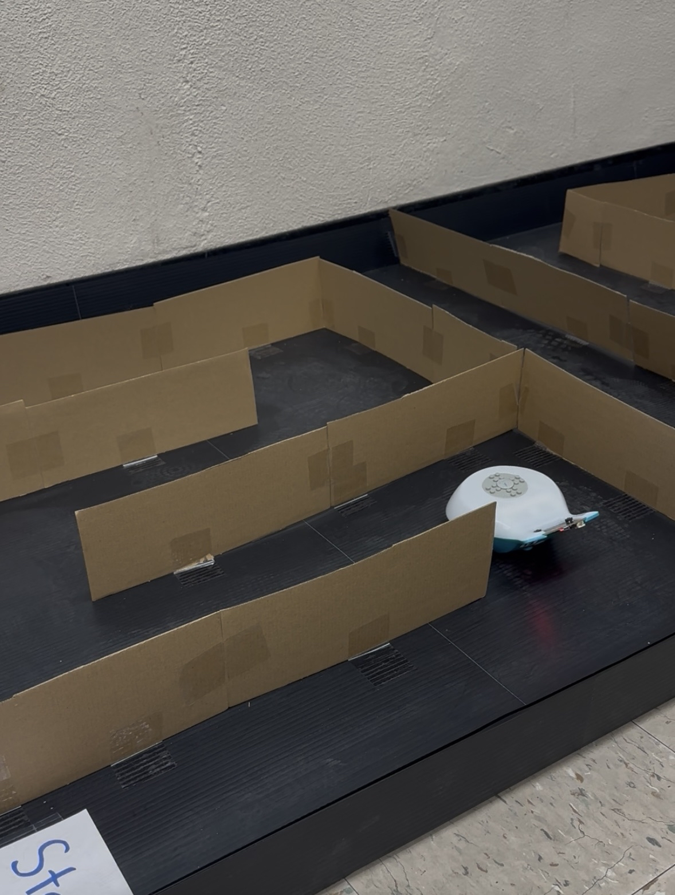

# Final Project: Finch Robot Challenges

## Project Description and Objectives
We were tasked to program a Finch Robot to navigate through a maze. Some of the objectives included the following:
- Using distance sensors to detect walls
- Implementing an algorithm for maze solving (wall following, etc.)
- Storing and analyzing the path taken
- Adding visual/audio feedback during navigation
- Optional: Allowing for maze "learning" and optimization on repeated runs

## Design Choices
As opposed to other groups, we took the more "dynamic" route and decided to use sensors to navigate the maze rather than hardcoding fixed distances. In the beginning, we decided to try and make it fully autonomous by having the robot check both sides at each stopping point. Later in the project, We did have to hardcode the turn directions as the robot's tail would get in the way during autonomous checking, and it also took a lot longer when checking both directions.
The robot autonomously moves by repeating moving forward 20 cm, using its sensors to get the distance from the obstacle infront of it, and moving back to a fixed distance if the robot is too close. This way, we ensure that the robot has enough space to turn.
We were able to hardcode the directions by using a string filled with "L's" and "R's" and using the substring method to make the robot turn left or right. Each iteration of stopping point goes to the next letter to turn correctly and traverse the maze successfully.

## Challenges Faced and Solutions
We faced a lot of challenges during this project. In the beginning, our original robot was broken and we had to get a new one so our testing was delayed for 1 or so days. When we were testing the functional robot, we had to tweak many values such as the fixed distance it should be from the wall in front of it, the fixed distance it travels forward, and the speeds of every movement. Even so, we still faced challenge as the robot was very inconsistent while testing. Sometimes it would not perfectly turn the intended degree angle and end up running into a wall. We tested this multiple times and concluded that it was just a minor calibration problem with the robot.

## Future Enhancements
Following up on the angle problem, I noticed that there was a compass method in the Finch API that returned the direction of the Finch in degrees from 0 to 359. I believe that I could enhance the robot's finnicky turning by checking the compass and making the Finch tweak to the true direction during every movement, ensuring that it would be perfectly turned and wouldn't run into walls as much. We also could have introduced more audible and visual programming in the robot, as it had methods for that, but we were so focused on just making it navigate the maze that we weren't able to implement it in time.

## Media

